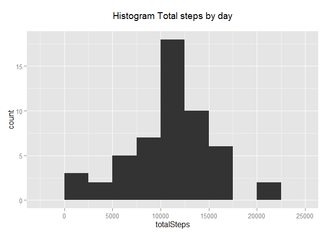
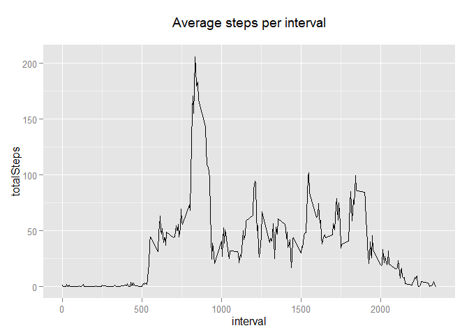
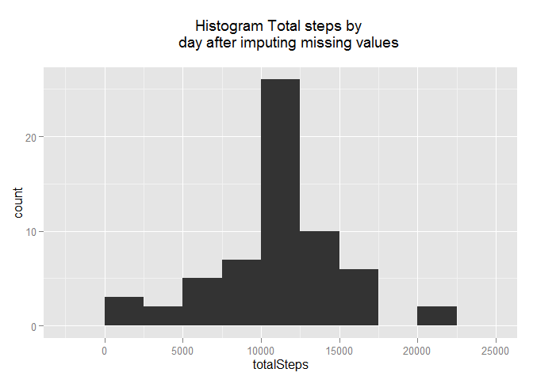
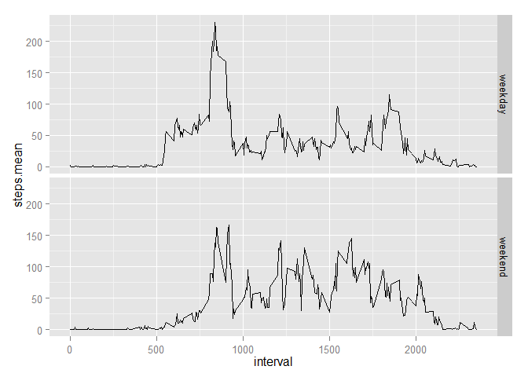

# Reproducible Research: Peer Assessment 1


## Loading and preprocessing the data

```r
library(dplyr)
library(ggplot2)

setwd("F:/Coursera/Data Science/Reproducible Research/Assessment 1/RepData_PeerAssessment1/")
activityData <- read.csv("Data/Raw/activity.csv")
activity.tbl_df <- tbl_df(activityData)

steps.byday <- activity.tbl_df %>%
    filter(!is.na(steps)) %>%
    group_by(date) %>%
    summarize(totalSteps = sum(steps))

steps.byinterval <- activity.tbl_df %>%
    filter(steps != "NA") %>%
    group_by(interval) %>%
    summarize(totalSteps = mean(steps))

steps.na <- activity.tbl_df %>%
     filter(is.na(steps)) %>%
     group_by(date) %>%
     summarize(totalNA = n())
```


## What is mean total number of steps taken per day?

```r
ggplot(steps.byday, aes(x=totalSteps)) + geom_histogram(binwidth = 2500) + ggtitle("Histogram Total steps by day\n")
```



```r
meanSteps <- mean(steps.byday$totalSteps)
medianSteps <- median(steps.byday$totalSteps)
```

The mean of total steps taken by day is 1.0766189\times 10^{4} and the median is 10765.

## What is the average daily activity pattern?

```r
ggplot(steps.byinterval, aes(x=interval, y = totalSteps)) + geom_line() + ggtitle("Average steps per interval\n")
```



```r
steps.max <- max(steps.byinterval$totalSteps)
interval.maxsteps <- steps.byinterval$interval[which(steps.byinterval$totalSteps == steps.max)]
```

The interval which has the max mean of steps is 835 with 206.1698113 steps. 

## Imputing missing values


```r
knitr::kable(steps.na, align=c('l','l'))
```


date         totalNA 
-----------  --------
2012-10-01   288     
2012-10-08   288     
2012-11-01   288     
2012-11-04   288     
2012-11-09   288     
2012-11-10   288     
2012-11-14   288     
2012-11-30   288     

As there are days which don't have any data available. The imputing missing strategy I've choosen is to use the average daily pattern to fill the NA values. So I'm putting the average interval steps into each interval where data is not available.


```r
steps.byinterval <- activity.tbl_df %>%
     filter(!is.na(steps)) %>%
     group_by(interval) %>%
     summarize(steps.mean= round(mean(steps)))

#Imputing missing values

activityImputed.tbl_df <- activity.tbl_df

activityImputed.tbl_df$steps[is.na(activity.tbl_df$steps)] <- rep(steps.byinterval$steps.mean, length(unique(activity.tbl_df$date)))[is.na(activity.tbl_df$steps)]


steps.byday <- activityImputed.tbl_df %>%
    group_by(date) %>%
    summarize(totalSteps = sum(steps))
```


```r
ggplot(steps.byday, aes(x=totalSteps)) + geom_histogram(binwidth = 2500) + ggtitle("Histogram Total steps by 
    day after imputing missing values\n")
```



```r
meanSteps <- mean(steps.byday$totalSteps)
medianSteps <- median(steps.byday$totalSteps)
```


The mean of total steps taken by day is 1.0765639\times 10^{4} and the median is 1.0762\times 10^{4}.

## Are there differences in activity patterns between weekdays and weekends?


```r
activity.week <- activityImputed.tbl_df %>%
     mutate(day = as.factor(ifelse (weekdays(as.Date(date)) %in% c("Sunday","Saturday"),"weekend","weekday"))) %>%
     group_by(day,interval) %>%
     summarize(steps.mean = mean(steps))
```

```r
ggplot(data=activity.week, aes(x=interval, y=steps.mean)) + geom_line() + facet_grid(day ~ .)
```

 
